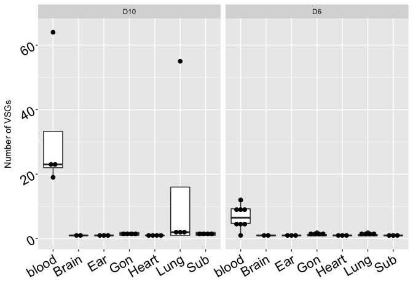

<!-- README.md is generated from README.Rmd. Please edit that file -->

# vsgseqtools

<!-- badges: start -->

<!-- badges: end -->

A collection of functions that helps analyze and tidy up the output from
VSG sequencing. The purpose of this package is to be used specifically
for analyzing data produced from the
[VSGSeqPipeline](https://github.com/mugnierlab/VSGSeqPipeline).

## Installation

``` r
library(devtools)
devtools::install_github("ABeav/vsgseqtools")
```

## Examples

There are several helpful tools in this package. Below is an example of
a few tools that help read in and analyze VSGSeqPipeline results.

``` r
library(tidyverse) # The tidyverse is required
library(vsgseqtools)

## This function accurately reads in the results from the raw VSGSeqPipeline output
results <- vsg_read("mock_data/mock_RESULTS.txt")
head(results)
#> # A tibble: 6 x 12
#>   samplename mouse day   tissue VSG   Percent   RPKM hit_VSG pct_id_vs_query
#>   <chr>      <chr> <chr> <chr>  <chr>   <dbl>  <dbl> <chr>             <dbl>
#> 1 M13_D6_Ear M13   D6    Ear    TRIN…     100 7.28e5 gnl|BL…            99.8
#> 2 M13_D6_Go… M13   D6    Gon    TRIN…     100 9.64e5 gnl|BL…            99.7
#> 3 M13_D6_He… M13   D6    Heart  TRIN…     100 7.28e5 gnl|BL…            99.8
#> 4 M13_D6_Lu… M13   D6    Lung   TRIN…     100 7.28e5 gnl|BL…            99.8
#> 5 M13_D6_Su… M13   D6    Sub    TRIN…     100 7.28e5 gnl|BL…            99.8
#> 6 M13_D6_bl… M13   D6    blood  TRIN…     100 7.28e5 gnl|BL…            99.8
#> # … with 3 more variables: pct_id_vs_match <dbl>, match_VSG_length <dbl>,
#> #   assembled_VSG_length <dbl>
```

The `vsg_rename()` function allows you to add a column for the clusters
produced by cd-hit in the VSGSeqpipeline. However, you do need to
provide a reference that has each VSG name and its associated cluster
name (I do this using this script
[MatchVSGs.py](additional_resources/)).

``` r
vsg_rename(results, "mock_data/cluster_reference_table.txt") %>%
  select(mouse, day, tissue, Percent, cluster, VSG)
#> # A tibble: 285 x 6
#>    mouse day   tissue Percent cluster    VSG                                    
#>    <chr> <chr> <chr>    <dbl> <chr>      <chr>                                  
#>  1 M13   D6    Ear        100 Cluster 72 TRINITY_DN478_c0_g1_i1_1_176_1568_M13_…
#>  2 M13   D6    Gon        100 Cluster 72 TRINITY_DN268_c0_g1_i1_1_44_1100_RC_M1…
#>  3 M13   D6    Heart      100 Cluster 72 TRINITY_DN77_c0_g1_i5_1_162_1554_M13_D…
#>  4 M13   D6    Lung       100 Cluster 72 TRINITY_DN12_c0_g1_i2_1_151_1543_M13_D…
#>  5 M13   D6    Sub        100 Cluster 72 TRINITY_DN236_c0_g1_i1_1_196_1588_M13_…
#>  6 M13   D6    blood      100 Cluster 72 TRINITY_DN0_c0_g2_i1_1_127_1519_RC_M13…
#>  7 M15   D10   Ear        100 Cluster 2  TRINITY_DN29_c0_g1_i1_1_62_1574_M15_D1…
#>  8 M15   D10   Gon        100 Cluster 2  TRINITY_DN243_c0_g1_i1_1_68_1580_M15_D…
#>  9 M15   D10   Heart      100 Cluster 2  TRINITY_DN4_c0_g1_i4_1_722_2234_M15_D1…
#> 10 M15   D10   Lung       100 Cluster 2  TRINITY_DN28_c0_g1_i1_1_68_1580_M15_D1…
#> # … with 275 more rows
```

Often when analyzing VSG expression, we count the total number of VSGs
in a sample. The `vsg_count` function helps streamline this with one
line of code.

``` r
results %>%
  vsg_count(mouse, day, tissue) 
#> # A tibble: 52 x 4
#>    mouse day   tissue vsg_count
#>    <chr> <chr> <chr>      <int>
#>  1 M13   D6    blood          1
#>  2 M13   D6    Ear            1
#>  3 M13   D6    Gon            1
#>  4 M13   D6    Heart          1
#>  5 M13   D6    Lung           1
#>  6 M13   D6    Sub            1
#>  7 M15   D10   blood         23
#>  8 M15   D10   Ear            1
#>  9 M15   D10   Gon            1
#> 10 M15   D10   Heart          1
#> # … with 42 more rows

# This can also be plotted directly after

results %>%
  vsg_count(mouse, day, tissue) %>%
  ggplot(aes(x = tissue, y = vsg_count)) + 
  facet_wrap("day") +
  geom_boxplot() +
  geom_dotplot(binaxis='y', stackdir= "center" , dotsize=.6, position=position_dodge(.75)) +
  xlab("") +
  ylab("Number of VSGs") +
  theme(axis.text = element_text(angle = 30,hjust = 1, size = 16, color = 'black'))
```



It can be helpful to look at the most highly expressed VSG in each
sample as well. I created a function, `vsg_max`, to help pull the
maximum expressed VSG out easily. This is particularly useful to find
the starting VSG expressed in an infection on day 6.

``` r
results %>%
  filter(day == "D6", tissue == "blood") %>%
  vsg_max(mouse) %>% 
  select(mouse, day, tissue, Percent, VSG)
#> # A tibble: 8 x 5
#>   mouse day   tissue Percent VSG                                            
#>   <chr> <chr> <chr>    <dbl> <chr>                                          
#> 1 M13   D6    blood    100   TRINITY_DN0_c0_g2_i1_1_127_1519_RC_M13_D6_blood
#> 2 M15   D6    blood     99.9 TRINITY_DN62_c0_g1_i1_1_85_1597_RC_M15_D6_blood
#> 3 M16   D6    blood     99.9 TRINITY_DN0_c0_g1_i1_1_80_1592_M16_D6_blood    
#> 4 M23   D6    blood     99.9 TRINITY_DN0_c0_g1_i1_1_1803_3195_M23_D6_blood  
#> 5 M39   D6    blood     91.5 TRINITY_DN0_c0_g1_i1_1_80_1592_M39_D6_blood    
#> 6 M40   D6    blood     97.0 TRINITY_DN0_c0_g2_i1_1_191_1583_M40_D6_blood   
#> 7 M42   D6    blood     99.9 TRINITY_DN0_c0_g1_i1_1_1722_3234_M42_D6_blood  
#> 8 M45   D6    blood     96.0 TRINITY_DN0_c0_g1_i1_1_72_1464_RC_M45_D6_blood
```

The last function I wanted to highlight is little more niche.
`vsg_expand` is helpful if you want to create a data frame that has
includes all VSGs found and represents them in each sample. VSGs that
were not found in a sample are represented by having a Percent of 0,
meaning 0% of parasites expressed that VSG.

``` r
 vsg_expand(results, "samplename", "VSG") %>%
  select(samplename, Percent, VSG)
#> Joining, by = c("samplename", "VSG")
#> # A tibble: 14,820 x 3
#>    samplename Percent VSG                                               
#>    <chr>        <dbl> <chr>                                             
#>  1 M13_D6_Ear     100 TRINITY_DN478_c0_g1_i1_1_176_1568_M13_D6_Ear      
#>  2 M13_D6_Ear       0 TRINITY_DN268_c0_g1_i1_1_44_1100_RC_M13_D6_Gon_Fat
#>  3 M13_D6_Ear       0 TRINITY_DN77_c0_g1_i5_1_162_1554_M13_D6_Heart     
#>  4 M13_D6_Ear       0 TRINITY_DN12_c0_g1_i2_1_151_1543_M13_D6_Lung      
#>  5 M13_D6_Ear       0 TRINITY_DN236_c0_g1_i1_1_196_1588_M13_D6_Sub_Cu   
#>  6 M13_D6_Ear       0 TRINITY_DN0_c0_g2_i1_1_127_1519_RC_M13_D6_blood   
#>  7 M13_D6_Ear       0 TRINITY_DN29_c0_g1_i1_1_62_1574_M15_D10_Ear       
#>  8 M13_D6_Ear       0 TRINITY_DN243_c0_g1_i1_1_68_1580_M15_D10_Gon_Fat  
#>  9 M13_D6_Ear       0 TRINITY_DN4_c0_g1_i4_1_722_2234_M15_D10_Heart     
#> 10 M13_D6_Ear       0 TRINITY_DN28_c0_g1_i1_1_68_1580_M15_D10_Lung      
#> # … with 14,810 more rows
```
